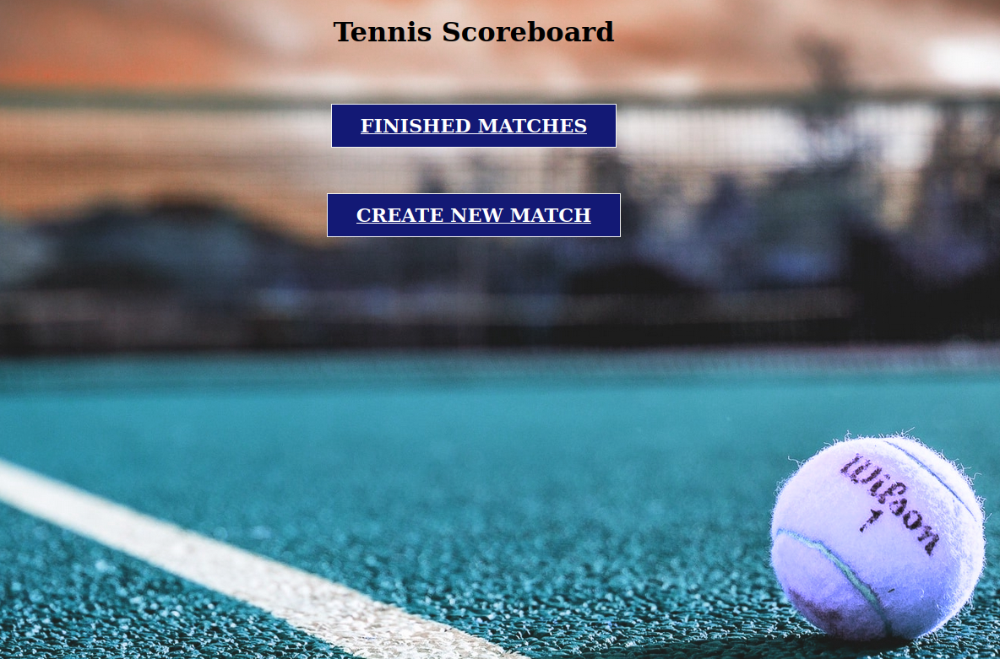
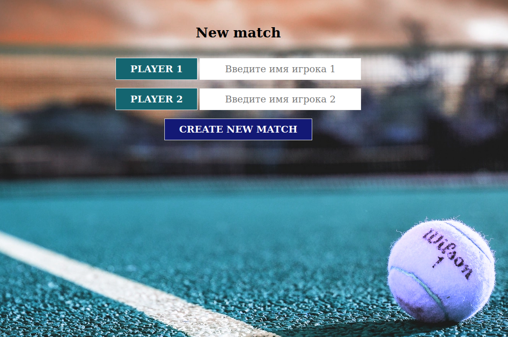
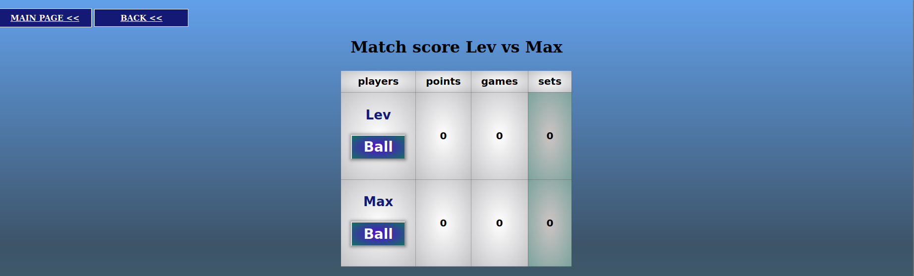
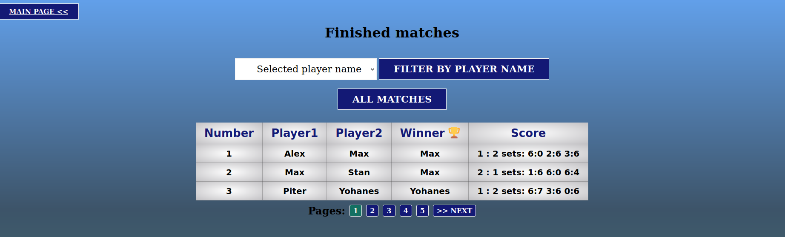

# TennisScoreBoard

Веб-приложение, реализующее табло счёта теннисного матча.

Работа с матчами:

    - Создание нового матча
    - Просмотр законченных матчей, поиск матчей по именам игроков
    - Подсчёт очков в текущем матче

Каждый матч играется по следующим правилам:

    - Матч играется до двух сетов (best of 3)
    - При счёте 6/6 в сете, играется тай-брейк до 7 очков

Стек:

    - Backend - Wsgiref.simple_server
    - Templates - Jinja2
    - Базы данных - Postgres, SQLAlchemy
    - Frontend - HTML/CSS, блочная вёрстка 
    - Тесты - Unittest
    - Паттерн MVC(S)

Структура приложения:

    Главная страница - кнопки, ведущие на страницы нового матча и списка завершенных матчей

    
    Страница нового матча - ввод имен игроков и кнопка создания матча

    Страница счёта матча - таблица с именами игроков и кнопками для действий -
    “игрок 1 выиграл текущее очко”, “игрок 2 выиграл текущее очко”

    Страница завершенных матчей

